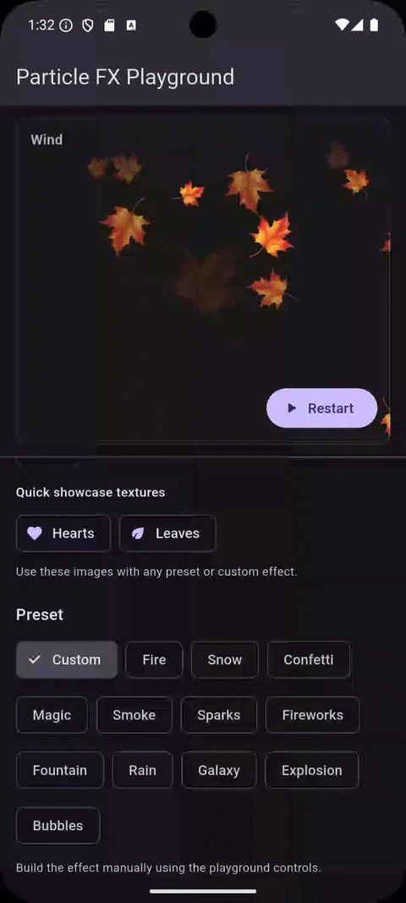

# particle_fx

[](https://pub.dev/packages/particle_fx)
[](https://pub.dev/packages/particle_fx/score)
[](LICENSE)
[](https://github.com/xxmushroom/particle_fx)

A high-performance, extensible particle effects engine for Flutter.

Build fire, smoke, snow, rain, sparks, fireworks, explosions, trails, vortex effects, interactive particle fields, and layered effects using your own image textures.

`particle_fx` is designed for developers who need more control than a simple confetti widget without paying the cost of a widget-per-particle architecture.

Particles are lightweight Dart objects simulated by an internal engine and rendered together through a single `CustomPainter`.

## Showcase



### Why particle_fx?

- **High-performance rendering** — thousands of particles can share a single canvas and decoded image textures.
- **Flexible emission** — bursts, continuous streams, timed streams, looping streams, and layered composite effects.
- **Extensible physics** — built-in forces plus a public API for implementing custom particle forces.
- **Rich appearance control** — lifetime opacity, scale, color, rotation, blend modes, trails, and weighted textures.
- **Reusable effects** — built-in presets and customizable `ParticlePreset` configurations.
- **Developer tooling** — live particle statistics, capacity monitoring, dropped-particle counts, FPS, and estimated draw calls.

**pub.dev:** [pub.dev/packages/particle_fx](https://pub.dev/packages/particle_fx)  
**GitHub:** [github.com/xxmushroom/particle_fx](https://github.com/xxmushroom/particle_fx)  
**API documentation:** [pub.dev/documentation/particle_fx/latest](https://pub.dev/documentation/particle_fx/latest/)

---

## Table of contents

- [Overview](#overview)
- [Features](#features)
- [Architecture](#architecture)
- [Installation](#installation)
- [Quick start](#quick-start)
- [Particle textures](#particle-textures)
- [Burst effects](#burst-effects)
- [Continuous streams](#continuous-streams)
- [Timed streams](#timed-streams)
- [Looping streams](#looping-streams)
- [Pause, resume, and stop](#pause-resume-and-stop)
- [Particle ranges](#particle-ranges)
- [Emitters](#emitters)
- [Emitter behavior](#emitter-behavior)
- [Particle appearance](#particle-appearance)
- [Opacity over lifetime](#opacity-over-lifetime)
- [Scale over lifetime](#scale-over-lifetime)
- [Pulse animation](#pulse-animation)
- [Color over lifetime](#color-over-lifetime)
- [Blend modes](#blend-modes)
- [Particle trails](#particle-trails)
- [Weighted textures](#weighted-textures)
- [Forces](#forces)
- [Force falloff](#force-falloff)
- [Pointer-driven effects](#pointer-driven-effects)
- [Presets](#presets)
- [Customizing presets](#customizing-presets)
- [Current built-in presets](#current-built-in-presets)
- [Composite effects](#composite-effects)
- [Delayed composite layers](#delayed-composite-layers)
- [Composite lifecycle callbacks](#composite-lifecycle-callbacks)
- [Performance statistics](#performance-statistics)
- [Particle capacity](#particle-capacity)
- [Rendering and performance](#rendering-and-performance)
- [Texture lifecycle](#texture-lifecycle)
- [Controller lifecycle](#controller-lifecycle)
- [Example application](#example-application)
- [Testing](#testing)
- [Public API overview](#public-api-overview)
- [Design goals](#design-goals)

---

# Overview

`particle_fx` is a general-purpose particle system for Flutter.

It can be used to create effects such as:

- fire
- smoke
- snow
- rain
- sparks
- fireworks
- explosions
- bubbles
- fountains
- magical particles
- galaxy effects
- vortex effects
- shockwaves
- confetti
- floating particles
- attraction and repulsion effects
- pointer-following effects
- layered cinematic effects
- custom effects using your own images

The package is not tied to one specific visual style.

You provide the particle image, and `particle_fx` controls:

- where particles spawn
- when particles spawn
- how many particles spawn
- their initial velocity
- their lifetime
- their rotation
- their size
- their color
- their opacity
- their scale
- the forces affecting them
- their trails
- their texture selection
- their sequencing
- their lifecycle callbacks

---

# Features

## Rendering

- Lightweight particle objects
- Single-canvas rendering
- `CustomPainter` based rendering
- No widget-per-particle architecture
- Configurable maximum active particle count
- Estimated draw-call statistics
- Shared decoded image textures
- Support for Flutter `BlendMode`

## Emission

- One-shot bursts
- Continuous particle streams
- Timed streams
- Looping timed streams
- Configurable loop delays
- Pause
- Resume
- Stop
- Configurable particles per second
- Configurable burst particle count

## Emitter support

- Point emitter
- Line emitter
- Rectangle emitter
- Circle emitter
- Disc emitter
- Cone emitter

## Motion

- Speed ranges
- Rotation ranges
- Angular velocity ranges
- Multiple simultaneous forces
- Extensible force system

## Built-in forces

Built-in force types include:

- Gravity
- Wind
- Drag
- Attractor
- Repulsor
- Vortex
- Turbulence
- Shockwave
- Spring
- Bounce
- Buoyancy
- Curl noise

## Appearance

- Size ranges
- Lifetime ranges
- Opacity over lifetime
- Scale over lifetime
- Color over lifetime
- Custom Flutter animation curves
- Built-in pulse lifetime curve
- Blend modes
- Trails

## Textures

- Single particle texture
- Multiple particle textures
- Weighted random texture selection
- Reusable decoded textures
- Explicit texture disposal

## Preset library

Built-in reusable presets:

- Fire
- Snow
- Confetti
- Magic
- Smoke
- Sparks
- Fireworks
- Fountain
- Rain
- Galaxy
- Explosion
- Bubbles

## Composite effect support

- Multiple layers
- Burst layers
- Stream layers
- Per-layer delays
- Sequenced effects
- Shared texture or weighted texture set
- Composite pause/resume
- Composite cancellation
- Safe replacement of an active composite
- Lifecycle callbacks
- Layer start callbacks
- Layer completion callbacks
- Composite completion callbacks

## Debugging and monitoring

- Active particle count
- Maximum particle count
- Capacity usage
- Total emitted particles
- Dropped particles
- Trail sample count
- Estimated draw calls
- FPS
- Frame time
- `ValueListenable` based stats updates

---

# Architecture

The package intentionally separates particle configuration, simulation, rendering, and control.

At a high level:

```text
ParticleFxController
        │
        ▼
     ParticleFx
        │
        ▼
   ParticleEngine
        │
        ▼
 Lightweight particles
        │
        ▼
 ImageParticleRenderer
        │
        ▼
   CustomPainter canvas
```

The controller tells the particle widget what should happen.

The engine owns simulation state.

The renderer draws particles.

Particles themselves are lightweight Dart objects rather than widgets.

This architecture is designed to make large particle systems practical without building a large Flutter element tree.

---

# Installation

After the package is published to pub.dev, add:

```yaml
dependencies:
  particle_fx: ^0.1.0
```

Then import it:

```
import 'package:particle_fx/particle_fx.dart';
```

---

# Quick start

A particle effect needs three things:

1. a `ParticleFxController`
2. a `ParticleFx` canvas
3. a decoded `ParticleTexture`

Import the package:

```
import 'package:particle_fx/particle_fx.dart';
```

## 1. Create a controller

Create the controller once in your widget state:

```
final ParticleFxController controller =
    ParticleFxController();
```

## 2. Add the particle canvas

Place `ParticleFx` anywhere in your widget tree.

It automatically fills the available space:

```
ParticleFx(
  controller: controller,
)
```

For example, it can be placed above your interface inside a `Stack`:
```
Stack(
  children: [
    const YourContent(),

    Positioned.fill(
      child: IgnorePointer(
        child: ParticleFx(
          controller: controller,
        ),
      ),
    ),
  ],
)
```

`IgnorePointer` is optional, but useful when particles are purely visual and
should not block taps on the UI underneath.

## 3. Load a particle texture

`particle_fx` renders image-based particles.

Decode the image once and reuse the resulting `ParticleTexture`:

```
final ByteData data =
    await rootBundle.load(
  'assets/particle.png',
);

final Uint8List bytes =
    data.buffer.asUint8List(
  data.offsetInBytes,
  data.lengthInBytes,
);

final ParticleTexture texture =
    await ParticleTexture.fromBytes(
  bytes,
);
```

This example requires:

```
import 'dart:typed_data';

import 'package:flutter/services.dart';
import 'package:particle_fx/particle_fx.dart';
```

## 4. Emit particles

Trigger a burst from anywhere that has access to the controller:

```
controller.burst(
  ParticleBurstConfig(
    texture: texture,
    count: 200,
  ),
);
```

That's enough to create your first particle effect.

From there you can add emitters, forces, trails, lifetime animations,
multiple textures, presets, timed streams, or composite effects without
changing the rendering architecture.

### Using a built-in preset

You can also use one of the built-in presets as a starting point:

```
controller.burst(
  ParticlePresets.fireworks.burst(
    texture: texture,
    count: 200,
  ),
);
```

Presets remain fully customizable, so they can be copied and adjusted instead
of forcing you into a fixed visual style.

---

# Particle textures

Particles use `ParticleTexture`.

A texture is decoded once and then shared by many particles.

This is important for performance.

Do not decode the same PNG or JPEG separately for every particle.

## Loading from asset bytes

```
import 'dart:typed_data';

import 'package:flutter/services.dart';
import 'package:particle_fx/particle_fx.dart';

Future<ParticleTexture> loadTexture() async {
  final ByteData data =
      await rootBundle.load(
    'assets/particle.png',
  );

  final Uint8List bytes =
      data.buffer.asUint8List(
    data.offsetInBytes,
    data.lengthInBytes,
  );

  return ParticleTexture.fromBytes(
    bytes,
  );
}
```

You can use any source that gives you image bytes.

For example:

- Flutter assets
- file picker
- image picker
- downloaded bytes
- generated image data

The package itself does not require a particular image-loading source.

---

# Burst effects

A burst creates a fixed number of particles once.

```
controller.burst(
  ParticleBurstConfig(
    texture: texture,
    count: 200,
  ),
);
```

A burst is useful for effects such as:

- explosions
- confetti
- impact sparks
- fireworks
- magical pulses
- button reactions
- reward effects
- hit effects

A more customized burst:

```
controller.burst(
  ParticleBurstConfig(
    texture: texture,
    count: 180,
    emitter: const PointEmitter(
      position: Alignment.center,
    ),
    speed: const ParticleRange(
      120,
      280,
    ),
    size: const ParticleRange(
      18,
      42,
    ),
    lifetime: const ParticleRange(
      1.0,
      2.2,
    ),
    rotation: const ParticleRange(
      0,
      6.28,
    ),
    angularVelocity:
        const ParticleRange(
      -3,
      3,
    ),
  ),
);
```

---

# Continuous streams

Continuous streams emit particles over time.

```
controller.start(
  ParticleStreamConfig(
    texture: texture,
    particlesPerSecond: 60,
  ),
);
```

Typical uses include:

- fire
- smoke
- snow
- rain
- fountains
- bubbles
- ambient magic
- galaxy effects

The stream remains active until it is stopped unless a duration is configured.

---

# Timed streams

A stream may have a fixed duration.

```
controller.start(
  ParticleStreamConfig(
    texture: texture,
    particlesPerSecond: 80,
    duration: const Duration(
      seconds: 3,
    ),
  ),
);
```

After the duration is reached, emission ends automatically.

Existing particles may continue moving until their own lifetime expires.

This distinction is important:

```text
Stream duration
    =
how long new particles are emitted

Particle lifetime
    =
how long each individual particle remains alive
```

---

# Looping streams

Timed streams can repeat.

```
controller.start(
  ParticleStreamConfig(
    texture: texture,
    particlesPerSecond: 80,
    duration: const Duration(
      seconds: 2,
    ),
    loop: true,
  ),
);
```

You can also insert a delay between loops:

```
controller.start(
  ParticleStreamConfig(
    texture: texture,
    particlesPerSecond: 80,
    duration: const Duration(
      seconds: 2,
    ),
    loop: true,
    loopDelay: const Duration(
      milliseconds: 500,
    ),
  ),
);
```

This can be useful for:

- pulsing magical effects
- repeated fountains
- periodic sparks
- repeating explosions
- intermittent smoke
- cyclic environmental effects

---

# Pause, resume, and stop

The controller exposes:

```
controller.pause();
```

```
controller.resume();
```

```
controller.stop();
```

Pause freezes stream/composite scheduling.

Resume continues the active schedule.

Stop cancels active stream scheduling or composite scheduling.

Delayed composite layers that have not started yet are also prevented from starting after the effect is stopped.

---

# Particle ranges

Several particle properties are expressed using `ParticleRange`.

A range allows every particle to receive a random value between a minimum and maximum.

Example:

```
const ParticleRange(
  120,
  260,
)
```

A fixed value can also be represented:

```
const ParticleRange.fixed(
  40,
)
```

Ranges are used for properties such as:

- speed
- size
- lifetime
- rotation
- angular velocity
- emitter direction ranges

Randomized ranges help avoid effects that look mechanically identical.

---

# Emitters

Emitters control where particles are created and, depending on the emitter, how their initial launch direction is generated.

The package currently includes six emitter types.

---

## PointEmitter

All particles originate from one point.

```
const PointEmitter(
  position: Alignment.center,
)
```

Useful for:

- explosions
- sparks
- magic bursts
- fireworks
- impact effects

---

## LineEmitter

Particles spawn along a line.

Example concept:

```
const LineEmitter(
  start: Alignment.topLeft,
  end: Alignment.topRight,
)
```

Useful for:

- rain
- snow
- waterfalls
- scanning effects
- particle curtains

A line emitter may also be configured with directional ranges.

---

## RectangleEmitter

Particles spawn throughout a rectangular area.

```
const RectangleEmitter(
  topLeft: Alignment(
    -0.75,
    -0.65,
  ),
  bottomRight: Alignment(
    0.75,
    0.25,
  ),
)
```

Useful for:

- ambient particles
- dust
- environmental effects
- area-based effects
- floating particles

---

## CircleEmitter

Particles originate along a circular shape.

```
const CircleEmitter(
  center: Alignment.center,
  radius: 90,
)
```

Useful for:

- rings
- portals
- circular magic
- orbit effects

---

## DiscEmitter

Particles spawn throughout a filled circular area rather than only from its edge.

Useful for:

- galaxy clouds
- portal interiors
- smoke areas
- radial fields
- large magical effects

---

## ConeEmitter

Particles originate from a point with a directional spread.

```
const ConeEmitter(
  position: Alignment(
    0,
    0.75,
  ),
  direction: -1.5708,
  spread: 1.0472,
)
```

Useful for:

- fountains
- flamethrower-style effects
- directional sparks
- smoke jets
- exhaust
- particle weapons

---

# Emitter behavior

Emitters answer two important questions:

```text
WHERE should a particle begin?
```

and:

```text
IN WHAT INITIAL DIRECTION should it move?
```

Emitters do not control when particles are emitted.

Scheduling belongs to:

- burst configuration
- continuous streams
- timed streams
- looping streams
- composite effect layers

This separation makes the system easier to customize.

---

# Particle appearance

Visual behavior is configured with `ParticleAppearance`.

For example:

```
const ParticleAppearance(
  opacity: ParticleLifetimeValue(
    begin: 1,
    end: 0,
  ),
  scale: ParticleLifetimeValue(
    begin: 1,
    end: 0.4,
  ),
)
```

Appearance can control:

- opacity
- scale
- color
- blend mode
- trails

---

# Opacity over lifetime

Opacity is represented by `ParticleLifetimeValue`.

Fade out:

```
const ParticleLifetimeValue(
  begin: 1,
  end: 0,
  curve: Curves.easeOut,
)
```

Fade in:

```
const ParticleLifetimeValue(
  begin: 0,
  end: 1,
  curve: Curves.easeOut,
)
```

Constant opacity:

```
const ParticleLifetimeValue.constant(
  1,
)
```

The lifetime value receives normalized progress:

```text
0.0 = particle just spawned
0.5 = halfway through lifetime
1.0 = end of lifetime
```

---

# Scale over lifetime

Scale uses the same lifetime interpolation system.

Shrink:

```
const ParticleLifetimeValue(
  begin: 1,
  end: 0.35,
  curve: Curves.easeIn,
)
```

Grow:

```
const ParticleLifetimeValue(
  begin: 0.35,
  end: 1.4,
  curve: Curves.easeOut,
)
```

This is useful for:

- smoke expansion
- shrinking sparks
- growing bubbles
- magical pulses
- explosion particles

---

# Pulse animation

`particle_fx` includes:

```
ParticleLifetimeCurves.pulse
```

The pulse curve behaves approximately like:

```text
start        middle        end
  0     →      1      →     0
```

Example:

```
const ParticleLifetimeValue(
  begin: 0,
  end: 1,
  curve: ParticleLifetimeCurves.pulse,
)
```

This is especially useful for:

- fade-in/fade-out
- glow pulses
- magic effects
- scale pulses
- temporary flashes

---

# Color over lifetime

Particle tint can change as the particle ages.

```
const ParticleColorOverLifetime(
  begin: Color(
    0xFFFFF59D,
  ),
  end: Color(
    0xFFFF3D00,
  ),
  curve: Curves.easeIn,
)
```

Constant color:

```
const ParticleColorOverLifetime.constant(
  Color(
    0xFFFFFFFF,
  ),
)
```

Color interpolation is useful for:

- fire
- cooling sparks
- magical gradients
- fading smoke
- elemental effects
- explosions
- glowing particles

Example fire-like appearance:

```
const ParticleAppearance(
  color: ParticleColorOverLifetime(
    begin: Color(
      0xFFFFF59D,
    ),
    end: Color(
      0xFFFF3D00,
    ),
    curve: Curves.easeIn,
  ),
)
```

---

# Blend modes

`ParticleAppearance` accepts a Flutter `BlendMode`.

For example:

```
const ParticleAppearance(
  blendMode: BlendMode.plus,
)
```

Common useful modes include:

```
BlendMode.srcOver
```

for normal rendering and:

```
BlendMode.plus
```

for additive glowing effects.

Additive blending works particularly well for:

- sparks
- magic
- explosions
- fire
- glowing particles
- fireworks

The package accepts Flutter blend modes directly.

Performance characteristics may vary between blend modes and devices.

---

# Particle trails

Trails allow a particle to leave previous position samples behind it.

Example:

```
const ParticleTrail(
  maxPoints: 8,
  sampleInterval: Duration(
    milliseconds: 40,
  ),
  opacity: 0.45,
  startScale: 0.55,
)
```

Attach it through appearance:

```
const ParticleAppearance(
  trail: ParticleTrail(
    maxPoints: 8,
    sampleInterval: Duration(
      milliseconds: 40,
    ),
    opacity: 0.45,
    startScale: 0.55,
  ),
)
```

---

## Trail properties

### `maxPoints`

Maximum number of stored trail samples.

Higher values create longer trails.

```
maxPoints: 8
```

---

### `sampleInterval`

How often the particle position is sampled.

```
sampleInterval: Duration(
  milliseconds: 40,
)
```

Shorter intervals produce denser trails.

---

### `opacity`

Controls trail transparency.

```
opacity: 0.45
```

---

### `startScale`

Controls the scale of older trail samples relative to the main particle.

```
startScale: 0.55
```

---

## Trail performance

Trails cost more to render.

A particle without a trail may require roughly one particle draw operation.

A particle with several trail points requires additional rendering work for each trail sample.

For example:

```text
1 live particle
+
8 trail samples
=
approximately 9 draw operations
```

Use trails selectively for effects where they provide meaningful visual value.

Good candidates include:

- sparks
- fireworks
- magic
- fast projectiles
- galaxy effects

---

# Weighted textures

A particle effect can use multiple images instead of one.

Create a `ParticleTextureSet`:

```
final ParticleTextureSet textureSet =
    ParticleTextureSet(
  variants: <ParticleTextureVariant>[
    ParticleTextureVariant(
      texture: textureA,
      weight: 1,
    ),
    ParticleTextureVariant(
      texture: textureB,
      weight: 3,
    ),
  ],
);
```

Then use:

```
controller.burst(
  ParticleBurstConfig(
    textureSet: textureSet,
    count: 200,
  ),
);
```

instead of:

```
texture: texture
```

---

## How weights work

Weights are relative.

Example:

```text
Texture A = 1
Texture B = 3
```

Texture B is expected to be selected roughly three times as often as Texture A.

Another example:

```text
A = 1
B = 1
C = 1
```

All three have equal probability.

Example:

```text
A = 5
B = 1
```

A is strongly favored.

The exact sequence is random.

---

## Single texture set

A texture set can also represent one texture.

```
final ParticleTextureSet set =
    ParticleTextureSet.single(
  texture,
);
```

---

## Texture selection timing

The engine chooses a texture when each particle is spawned.

The selected texture belongs to that particle for its lifetime.

---

# Forces

Forces modify particle velocity and movement during simulation.

Multiple forces can be combined.

Conceptually:

```
forces: <ParticleForce>[
  // force 1
  // force 2
  // force 3
],
```

The current package includes the following force families.

---

## Gravity

Pulls particles downward.

Useful for:

- confetti
- sparks
- fireworks
- fountains
- falling debris

---

## Wind

Pushes particles in a direction.

Useful for:

- snow
- smoke
- rain
- environmental effects

---

## Drag

Reduces velocity over time.

Useful for:

- smoke
- slow magical particles
- explosions that rapidly lose energy
- realistic deceleration

---

## Attractor

Pulls particles toward a target point.

Useful for:

- black-hole effects
- particle gathering
- cursor attraction
- magical orbs
- vortex centers

---

## Repulsor

Pushes particles away from a target point.

Useful for:

- shock-like fields
- cursor repulsion
- explosions
- force fields

---

## Vortex

Causes particles to rotate around a center.

Useful for:

- tornadoes
- galaxies
- portals
- magical swirls
- whirlpools

---

## Turbulence

Introduces smooth chaotic motion.

Useful for:

- smoke
- fire
- snow
- magic
- atmospheric particles

---

## Shockwave

Applies a strong short-lived outward push.

Useful for:

- explosions
- impacts
- energy pulses
- magical blasts

---

## Spring

Pulls particles toward a point using spring-like behavior.

Useful for:

- elastic motion
- orbital effects
- bouncing particle clusters
- reactive interfaces

---

## Bounce

Allows particles to react to the preview/canvas edges.

Useful for:

- confetti
- balls
- bubbles
- playful UI effects
- physics-like particle motion

---

## Buoyancy

Pushes particles upward.

Useful for:

- smoke
- bubbles
- fire
- steam
- dust

---

## Curl noise

Creates smooth swirling vector-field movement.

Useful for:

- flowing smoke
- galaxies
- magical fields
- organic particle motion
- wind-like effects

---

# Force falloff

Some positional forces may vary in strength depending on distance from their target.

Supported falloff concepts include:

- constant
- linear
- inverse
- inverse square

Conceptually:

### Constant

Same force strength at all distances.

### Linear

Force gradually weakens with distance.

### Inverse

Strong nearby and smoothly weaker farther away.

### Inverse square

Very strong near the target and rapidly weaker farther away.

Falloff makes attractors, repulsors, vortexes, and similar effects much more flexible.

---

# Pointer-driven effects

`particle_fx` supports dynamic force targets.

The package includes:

```
ParticleForceTargetController
```

A target controller can be updated as pointer or touch input moves.

Example setup:

```
final ParticleForceTargetController
    targetController =
    ParticleForceTargetController();
```

When the pointer moves:

```
targetController.update(
  localPosition,
);
```

This allows effects such as:

- particles following the finger
- particles avoiding the finger
- pointer-controlled vortex
- interactive attraction
- interactive repulsion

The example playground includes interactive target-controlled effects.

---

# Presets

Presets provide ready-made motion and appearance configurations.

The preset itself does not own the image.

You still provide:

```
texture
```

or:

```
textureSet
```

This means the same preset can work with any particle artwork.

---

## Burst preset

```
controller.burst(
  ParticlePresets.fireworks.burst(
    texture: texture,
    count: 180,
  ),
);
```

---

## Stream preset

```
controller.start(
  ParticlePresets.fire.stream(
    texture: texture,
    particlesPerSecond: 80,
  ),
);
```

---

## Weighted preset

Presets can also use weighted textures:

```
controller.burst(
  ParticlePresets.confetti.burst(
    textureSet: textureSet,
    count: 250,
  ),
);
```

---

# Customizing presets

A `ParticlePreset` groups together reusable configuration such as:

- emitter
- speed
- size
- lifetime
- rotation
- angular velocity
- appearance
- forces

Presets can be copied and adjusted using:

```
copyWith(...)
```

This makes it possible to start from a built-in effect and create variants without rebuilding every property manually.

For example, conceptually:

```
final ParticlePreset customFire =
    ParticlePresets.fire.copyWith(
  // override selected values
);
```

---

# Current built-in presets

## Fire

Designed around:

- rising motion
- warm colors
- turbulence
- buoyancy
- drag

Best for:

- flames
- torches
- magic fire
- burning UI effects

---

## Snow

Designed around:

- top-area emission
- downward movement
- gentle turbulence

Best for:

- snow
- floating flakes
- soft environmental particles

---

## Confetti

Designed around:

- fast upward burst
- gravity
- strong rotation

Best for:

- celebrations
- rewards
- achievements
- success screens

---

## Magic

Designed around:

- glowing particles
- swirling movement
- short trails

Best for:

- spells
- portals
- fantasy UI
- glowing effects

---

## Smoke

Designed around:

- slower particles
- expansion
- upward movement
- turbulence

Best for:

- smoke
- fog
- steam
- atmospheric effects

---

## Sparks

Designed around:

- fast particles
- gravity
- bright short trails

Best for:

- impacts
- welding
- weapons
- fire
- mechanical effects

---

## Fireworks

Designed around:

- radial burst
- gravity
- long glowing trails

Best for:

- fireworks
- celebrations
- large visual bursts

---

## Fountain

Designed around:

- directional upward stream
- gravity
- arcing motion

Best for:

- fountains
- geysers
- upward magical streams

---

## Rain

Designed around:

- top-area emission
- fast downward movement
- gravity
- wind
- short trails

Best for:

- rain
- storms
- weather overlays

---

## Galaxy

Designed around:

- longer particle lifetime
- vortex movement
- turbulence
- glowing appearance

Best for:

- galaxies
- space
- portals
- energy fields

---

## Explosion

Designed around:

- violent burst
- additive appearance
- shockwave-like motion

Best for:

- explosions
- impacts
- action effects

---

## Bubbles

Designed around:

- soft movement
- upward buoyancy
- expansion
- gentle turbulence

Best for:

- bubbles
- underwater effects
- playful UI
- floating ambient particles

---

# Composite effects

Composite effects allow several particle layers to run together as one higher-level effect.

A composite contains:

```
ParticleEffectLayer
```

objects.

Each layer can be:

```text
Burst
```

or:

```text
Stream
```

---

## Example composite

```
final ParticleCompositeEffect effect =
    ParticleCompositeEffect(
  layers: <ParticleEffectLayer>[
    ParticleEffectLayer.burst(
      preset: ParticlePresets.explosion,
      count: 90,
    ),
    ParticleEffectLayer.burst(
      preset: ParticlePresets.sparks,
      count: 180,
      delay: const Duration(
        milliseconds: 80,
      ),
    ),
    ParticleEffectLayer.stream(
      preset: ParticlePresets.smoke,
      particlesPerSecond: 35,
      duration: const Duration(
        seconds: 2,
      ),
      delay: const Duration(
        milliseconds: 250,
      ),
    ),
  ],
);
```

Play it:

```
controller.play(
  effect,
  texture: texture,
);
```

---

# Delayed composite layers

Every composite layer may have its own delay.

Example timeline:

```text
0 ms
Explosion burst begins

80 ms
Spark burst begins

250 ms
Smoke stream begins
```

This makes it possible to build effects that feel authored rather than simultaneous.

Examples:

```text
Explosion
→ sparks
→ smoke
```

```text
Firework
→ secondary sparks
→ trailing smoke
```

```text
Magic particles
→ galaxy vortex
```

```text
Rain
→ fire
→ magic
```

The delay belongs to each individual layer.

---

# Composite burst layer

```
ParticleEffectLayer.burst(
  preset: ParticlePresets.sparks,
  count: 120,
  delay: const Duration(
    milliseconds: 100,
  ),
)
```

---

# Composite stream layer

```
ParticleEffectLayer.stream(
  preset: ParticlePresets.smoke,
  particlesPerSecond: 30,
  duration: const Duration(
    seconds: 2,
  ),
  delay: const Duration(
    milliseconds: 300,
  ),
)
```

Stream layers may also support looping behavior.

---

# Composite pause and resume

Composite scheduling participates in controller pause/resume behavior.

When a composite is paused:

- active scheduling stops advancing
- delayed layers do not continue counting down
- delayed layers do not unexpectedly start during the pause

After resume, scheduling continues.

---

# Composite cancellation

Calling:

```
controller.stop();
```

cancels an active composite.

Layers that have not started yet will not be started afterward.

Starting another effect also invalidates stale composite scheduling.

This protects against old delayed layers firing after a replacement effect has already begun.

---

# Composite lifecycle callbacks

Composite effects support lifecycle callbacks.

```
controller.play(
  effect,
  texture: texture,
  callbacks:
      ParticleCompositeCallbacks(
    onStarted: () {
      print(
        'Effect started',
      );
    },
    onLayerStarted: (
      int index,
      ParticleEffectLayer layer,
    ) {
      print(
        'Layer $index started',
      );
    },
    onLayerCompleted: (
      int index,
      ParticleEffectLayer layer,
    ) {
      print(
        'Layer $index completed',
      );
    },
    onCompleted: () {
      print(
        'Effect completed',
      );
    },
  ),
);
```

Available callbacks:

```
onStarted
```

Called when the composite runtime actually begins.

```
onLayerStarted
```

Called when an individual layer begins.

```
onLayerCompleted
```

Called when a finite layer finishes.

```
onCompleted
```

Called when the entire finite composite completes.

---

## Callback safety

Composite callbacks are revision-safe.

If a callback:

- stops the current effect
- starts another composite
- replaces the current composite

the old scheduler state is prevented from continuing incorrectly.

This is important for interactive effects where callbacks may trigger application logic.

---

# Performance statistics

The controller exposes live statistics.

```
controller.stats
```

returns the latest snapshot.

For reactive UI, use:

```
controller.statsListenable
```

Example:

```
ValueListenableBuilder<ParticleFxStats>(
  valueListenable:
      controller.statsListenable,
  builder: (
    BuildContext context,
    ParticleFxStats stats,
    Widget? child,
  ) {
    return Column(
      crossAxisAlignment:
          CrossAxisAlignment.start,
      children: [
        Text(
          'Particles: '
          '${stats.activeParticles}',
        ),
        Text(
          'FPS: '
          '${stats.fps.toStringAsFixed(1)}',
        ),
      ],
    );
  },
)
```

---

# ParticleFxStats

Available statistics include:

## `activeParticles`

Current number of live particles.

```
stats.activeParticles
```

---

## `maxParticles`

Configured capacity.

```
stats.maxParticles
```

---

## `capacityUsage`

Fraction of particle capacity currently in use.

```
stats.capacityUsage
```

For example:

```text
activeParticles = 2500
maxParticles = 5000

capacityUsage = 0.5
```

---

## `emittedParticles`

Total number of particles successfully created.

```
stats.emittedParticles
```

This is cumulative for the active engine instance.

---

## `droppedParticles`

Particles that could not be created because the particle capacity was already full.

```
stats.droppedParticles
```

This is useful for detecting effects that regularly exceed the configured maximum.

---

## `trailSamples`

Current total number of stored trail points.

```
stats.trailSamples
```

---

## `estimatedDrawCalls`

Approximate number of particle/trail draw operations required.

```
stats.estimatedDrawCalls
```

This can help explain why a system with relatively few particles may still be expensive when long trails are enabled.

---

## `fps`

Measured particle widget frame rate.

```
stats.fps
```

---

## `frameTimeMs`

Measured average frame time in milliseconds.

```
stats.frameTimeMs
```

---

# Particle capacity

By default:

```
ParticleFx(
  controller: controller,
)
```

uses a maximum particle capacity of:

```text
5000
```

You can change it:

```
ParticleFx(
  controller: controller,
  maxParticles: 8000,
)
```

When the engine is full, extra spawn requests are dropped.

The engine does not continue growing beyond the configured capacity.

This avoids accidental unbounded particle growth.

---

## Capacity example

Suppose:

```text
maxParticles = 1000
current particles = 950
requested new particles = 100
```

Only approximately:

```text
50
```

can be accepted.

The remaining particles are counted as dropped.

---

# Rendering and performance

The package is designed around a few important performance principles.

---

## One particle is not one widget

Particles are not individual Flutter widgets.

This avoids creating thousands of:

- elements
- render objects
- widget rebuilds

Instead, particles are simulated as lightweight objects and rendered together.

---

## Single CustomPainter

The visual output is drawn on one particle canvas.

This allows the package to efficiently render large particle groups compared with a widget-per-particle design.

---

## Shared image decoding

A `ParticleTexture` contains a decoded image that can be shared by many particles.

You should load a texture once:

```
final ParticleTexture texture =
    await ParticleTexture.fromBytes(
  bytes,
);
```

and reuse it.

Avoid repeatedly decoding the same image for repeated effects.

---

## Trails increase work

A normal particle may require one image draw.

A particle with trail samples may require several additional draws.

Therefore:

```text
200 particles without trails
```

may be significantly cheaper than:

```text
200 particles with 12-point trails
```

---

## Blend mode performance

Some blend modes may be more expensive than others depending on the rendering backend and device.

If performance matters, profile effects on the devices you plan to support.

---

## Particle count

More particles increase:

- simulation work
- force calculations
- draw operations

Use only as many particles as needed to achieve the visual effect.

---

## Expensive force combinations

Several complex forces combined across thousands of particles may increase CPU work.

For large effects, profile:

- turbulence
- vortex
- curl noise
- long trails
- many simultaneous forces

---

## Use the stats panel

The built-in stats API can help identify:

- capacity saturation
- high trail sample counts
- high draw-call estimates
- dropped particles
- frame-rate degradation

---

# Texture lifecycle

A `ParticleTexture` owns decoded image resources.

Dispose textures when they are no longer required.

```
if (!texture.isDisposed) {
  texture.dispose();
}
```

Do not dispose a texture while active particles are still expected to render with it.

A typical pattern is to keep textures alive for the lifetime of the screen or particle system that owns them.

---

# Controller lifecycle

The controller should also be disposed.

```
@override
void dispose() {
  controller.dispose();

  super.dispose();
}
```

Combined example:

```
@override
void dispose() {
  controller.dispose();

  if (!texture.isDisposed) {
    texture.dispose();
  }

  super.dispose();
}
```

---

# Full basic StatefulWidget example

```
import 'dart:typed_data';

import 'package:flutter/material.dart';
import 'package:flutter/services.dart';
import 'package:particle_fx/particle_fx.dart';

class ParticleExample
    extends StatefulWidget {
  const ParticleExample({
    super.key,
  });

  @override
  State<ParticleExample>
      createState() =>
          _ParticleExampleState();
}

class _ParticleExampleState
    extends State<ParticleExample> {
  final ParticleFxController
      _controller =
      ParticleFxController();

  ParticleTexture? _texture;

  @override
  void initState() {
    super.initState();

    _loadTexture();
  }

  Future<void> _loadTexture()
      async {
    final ByteData data =
        await rootBundle.load(
      'assets/particle.png',
    );

    final Uint8List bytes =
        data.buffer.asUint8List(
      data.offsetInBytes,
      data.lengthInBytes,
    );

    final ParticleTexture texture =
        await ParticleTexture
            .fromBytes(
      bytes,
    );

    if (!mounted) {
      texture.dispose();
      return;
    }

    setState(() {
      _texture = texture;
    });
  }

  void _burst() {
    final ParticleTexture? texture =
        _texture;

    if (texture == null) {
      return;
    }

    _controller.burst(
      ParticleBurstConfig(
        texture: texture,
        count: 200,
      ),
    );
  }

  @override
  void dispose() {
    _controller.dispose();

    final ParticleTexture? texture =
        _texture;

    if (texture != null &&
        !texture.isDisposed) {
      texture.dispose();
    }

    super.dispose();
  }

  @override
  Widget build(
    BuildContext context,
  ) {
    return Scaffold(
      body: Stack(
        children: [
          Positioned.fill(
            child: ParticleFx(
              controller:
                  _controller,
            ),
          ),
          Center(
            child:
                FilledButton(
              onPressed:
                  _texture == null
                      ? null
                      : _burst,
              child: const Text(
                'Burst',
              ),
            ),
          ),
        ],
      ),
    );
  }
}
```

---

# Example application

The repository contains a full interactive playground in:

```text
/example
```

The playground is intended to demonstrate almost every public feature of the package.

It includes controls for:

- image selection
- single texture mode
- weighted texture mode
- texture weights
- particle count
- emission mode
- particles per second
- stream duration
- stream looping
- loop delay
- emitters
- speed
- lifetime
- opacity
- scale
- color
- blend mode
- trails
- trail density
- trail opacity
- forces
- force strength
- falloff
- pointer-controlled targets
- presets
- composite effects
- delayed layers
- lifecycle callbacks
- performance statistics
- generated Dart code

The example app is the best place to experiment visually with combinations before moving the configuration into your own app.

---

# Example effect workflow

A useful workflow when designing a new effect is:

```text
1. Choose a particle image
2. Choose burst or stream
3. Choose an emitter
4. Tune speed
5. Tune lifetime
6. Tune size
7. Add appearance changes
8. Add forces
9. Add trails if needed
10. Check performance stats
11. Convert into a preset or composite effect
```

---

# Combining effects

A complex effect can often be thought of as several simpler effects.

For example:

```text
Explosion
=
bright central burst
+
fast sparks
+
slow smoke
```

Instead of forcing one particle configuration to do everything, use:

```
ParticleCompositeEffect
```

with several layers.

This usually creates a more natural result.

---

# Custom effects

You do not need to use built-in presets.

A custom effect can be created by directly combining:

```text
ParticleBurstConfig
or
ParticleStreamConfig

+

Emitter

+

ParticleRange values

+

ParticleAppearance

+

ParticleForce list
```

This makes the package suitable for both simple and advanced particle systems.

---

# Public API overview

The public API is organized around several groups.

---

## Core widget

```
ParticleFx
```

Responsible for:

- simulation lifecycle
- rendering
- frame updates
- statistics publication

---

## Controller

```
ParticleFxController
```

Responsible for commands such as:

```
burst(...)
start(...)
pause()
resume()
stop()
play(...)
```

and exposing state/statistics.

---

## Configurations

```
ParticleBurstConfig
```

```
ParticleStreamConfig
```

---

## Texture API

```
ParticleTexture
```

```
ParticleTextureVariant
```

```
ParticleTextureSet
```

---

## Appearance API

```
ParticleAppearance
```

```
ParticleLifetimeValue
```

```
ParticleLifetimeCurves
```

```
ParticleColorOverLifetime
```

```
ParticleTrail
```

---

## Emitter API

```
PointEmitter
LineEmitter
RectangleEmitter
CircleEmitter
DiscEmitter
ConeEmitter
```

---

## Preset API

```
ParticlePreset
```

```
ParticlePresets
```

---

## Composite effect API

```
ParticleCompositeEffect
```

```
ParticleEffectLayer
```

```
ParticleCompositeCallbacks
```

---

## Debugging

```
ParticleFxStats
```

---

# Testing

The package contains automated tests covering major behavior.

Current test areas include:

- effect-layer configuration
- composite effect validation
- immutable composite layer storage
- controller state
- burst revision handling
- stream start
- stream pause
- stream resume
- stream stop
- composite replacement
- stale composite revision safety
- lifecycle callbacks
- scheduler timing
- zero-delay layers
- delayed layers
- pause freezing delayed schedules
- stop cancelling delayed layers
- finite stream completion
- callback ordering
- callback-triggered cancellation
- particle capacity
- emitted particle counting
- dropped particle counting
- particle expiry
- capacity reuse after expiry
- trail sampling
- trail maximum point limits
- trail cleanup
- estimated draw calls
- lifetime interpolation
- curve interpolation
- pulse interpolation
- color interpolation
- color clamping
- weighted texture sampling
- weighted texture validation
- texture-set immutability

Run:

```bash
flutter test
```

Static analysis:

```bash
flutter analyze
```

---

# Design goals

`particle_fx` follows several design principles.

---

## Lightweight particles

Particles should be data and simulation objects, not widgets.

---

## Extensibility

Emitters and forces should be usable as building blocks rather than hard-coded visual effects.

---

## Separation of responsibilities

Emitters decide where particles begin.

Scheduling decides when particles are created.

Forces decide how particles move afterward.

Appearance decides how particles look.

---

## Reusable textures

Decoded images should be shared rather than repeatedly decoded.

---

## Flexible composition

Complex effects should be built by combining simple particle layers.

---

## Developer visibility

Performance statistics should be available instead of forcing developers to guess why an effect is slow.

---

## Practical defaults

The package includes presets for common effects while still allowing full custom configuration.

---

# Choosing burst vs stream

Use a burst when the effect represents one event.

Examples:

```text
explosion
impact
firework
reward
confetti
spell cast
```

Use a stream when the effect represents something ongoing.

Examples:

```text
fire
smoke
snow
rain
fountain
bubbles
ambient magic
```

---

# Choosing an emitter

Use:

```text
PointEmitter
```

for central bursts.

Use:

```text
LineEmitter
```

for rain or snow.

Use:

```text
RectangleEmitter
```

for area effects.

Use:

```text
CircleEmitter
```

for rings.

Use:

```text
DiscEmitter
```

for filled circular regions.

Use:

```text
ConeEmitter
```

for directional jets.

---

# Choosing appearance behavior

Use fade-out for:

- sparks
- smoke
- fire

Use fade-in/out for:

- magic
- soft glow
- ambient effects

Use shrinking scale for:

- sparks
- disappearing fragments

Use growing scale for:

- smoke
- bubbles
- expanding magic

Use pulse scale for:

- magic
- energy effects
- portal particles

---

# Choosing trails

Trails are most useful when particle motion is fast enough for direction to matter visually.

Good:

- fireworks
- sparks
- magic projectiles
- galaxy particles

Usually unnecessary:

- slow smoke
- dense snow
- bubbles
- large ambient particle fields

---

# Choosing particle count

There is no universal ideal particle count.

The correct number depends on:

- texture size
- screen size
- lifetime
- trail length
- active forces
- target device
- blend mode
- visual density

Use the performance stats rather than relying only on visual intuition.

---

# Suggested profiling workflow

When optimizing an effect:

```text
1. Check active particles
2. Check capacity usage
3. Check dropped particles
4. Check trail sample count
5. Check estimated draw calls
6. Check FPS
7. Check frame time
8. Reduce the most expensive feature first
```

Common optimization steps:

```text
reduce particle count
reduce particles per second
shorten lifetime
shorten trails
increase trail sample interval
reduce simultaneous forces
avoid unnecessarily expensive blend modes
```

---

# Why use image particles?

Using image particles allows the same engine to render very different effects simply by changing the source texture.

For example, the same motion system can render:

- circles
- stars
- snowflakes
- leaves
- sparks
- custom icons
- glowing blobs
- confetti pieces
- smoke sprites

This keeps the simulation system independent from the visual artwork.

---

# Package philosophy

`particle_fx` is intended to sit between two extremes.

It is more capable than a single-purpose confetti or snow widget, but it does not require a separate game engine.

The package aims to provide:

```text
Flutter-native API
+
custom particle physics
+
reusable presets
+
developer-friendly configuration
+
single-canvas rendering
```

for applications that need richer particle effects without leaving Flutter.

---

# Version

Current package version:

```text
0.1.0
```

This version includes the core particle system, emitters, forces, appearance-over-lifetime system, trails, weighted textures, presets, timed streams, looping streams, composite effects, lifecycle callbacks, performance statistics, and automated tests.